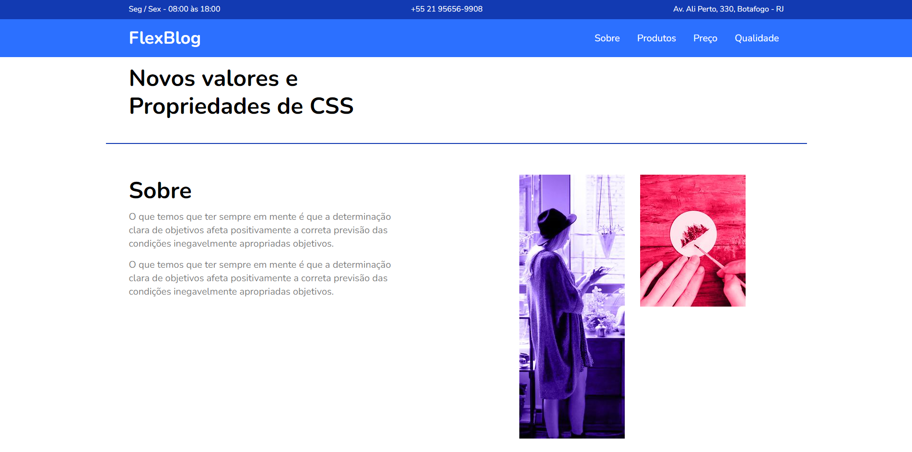

<h1 align="center">
  
</h1>

  <a href="#-tecnologias">Tecnologias</a>&nbsp;&nbsp;&nbsp;|&nbsp;&nbsp;&nbsp;
  <a href="#-projeto">Projeto</a>&nbsp;&nbsp;&nbsp;|&nbsp;&nbsp;&nbsp;
  <a href="#-layout">Layout</a>&nbsp;&nbsp;&nbsp;&nbsp;&nbsp;&nbsp;

 

  

## 🚀 Tecnologias

Esee projeto foi desenvolvido utilizando as tecnologias:

- HTML
- CSS

## 💻 Projeto

Site feito para treinar praticas de Flexbox.

## 🔖 Layout

Link para acessar o projeto [Link do projeto target="blank"](https://gabrielbaltar.github.io/flexblog.com.br/)
